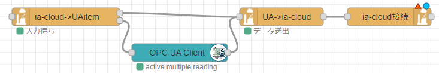

# OPC UA Server Items to ia-Cloud

[Link to Japanese: 日本語](readme_ja.md)

---

## Overview
Get the data using [node-red-contrib-opcua](https://www.npmjs.com/package/node-red-contrib-opcua) node and send to ia-Cloud.  
Regarding the connection to OPC UA Server, please refer to [node-red-contrib-opcua](https://www.npmjs.com/package/node-red-contrib-opcua).

---
## Structure

To send data from an OPC UA Server to ia-Cloud, users need to configure the data they want to send to ia-Cloud. Users define the data using the ia-cloud->UAitem node. The UA->ia-cloud node creates an ia-cloud object based on the defined data and the data values obtained from the OPC UA Client node. This data is then sent to ia-Cloud using the [ia-cloud connection node](https://github.com/ia-cloud/node-red-contrib-ia-cloud-fds/blob/master/ia-cloud-cnct/readme.md) or the [object array node](https://github.com/ia-cloud/node-red-contrib-ia-cloud-fds/blob/master/ia-cloud-object-array/readme.md).

---

## ia-cloud->UAitem node

Register the necessary information and OPC UA items to send data to ia-Cloud.  

### Properties

|Name|Description|
|:--|:--|
|OPC Action|Set the Action which will be selected in OPC UA Client node. The actions supported in this node are below. - READ - READ MULTIPLE - SUBSCRIBE|

- Object Configuration Tab

|Name|Description|
|:--|:--|
|Initial Delay(sec)|Set the wait time in seconds if the flow needs to wait for output message to OPC UA Client node at startup.|
|Scan Rate(sec)|Set the number of seconds to cyclic output messages to OPC UA Client node when using READ or READ MULTIPLE action. Set 0 when cyclic read from OPC UA Server is not required. When using SUBSCRIBE, configure the interval in OPC UA Client node.|
|Object Key|Set a unique key as string which is assigned to data items of OPC UA Server.|
|Object Description|Provide description of data items of OPC UA Server.|

- DataItem Configuration Tab

|Name|Description|
|:--|:--|
|Content Type|Set content type as string. User can define the own content type. The default is "ia-CloudData".|
|Data Name|Name of data. Data Name should be unique string in Object Key.|
|Unit|Set unit as string if required.|
|Node ID|Set Node ID to provide to OPC UA Client node.|

### Input
Output message(s) without any dependencies from input message.

### Output
Connect output 1 (top) to the UA->ia-cloud node and output 2 (bottom) to the OPC UA Client node.

---

## UA->ia-cloud node

Create and output data to ia-Cloud based on the settings in the ia-cloud->UAitem node and the data obtained from the OPC UA Client node.

### Input

- Output 1 of ia-cloud->UAitem node
  Get the configuration data from a-cloud->item node.
  To output data to ia-Cloud, the configuration data is required.
- Output of OPC UA Client node
  Get the data value which OPC UA Client node read from OPC UA Server.

### Output
Connect to  ia-cloud connection node or the object array node.
